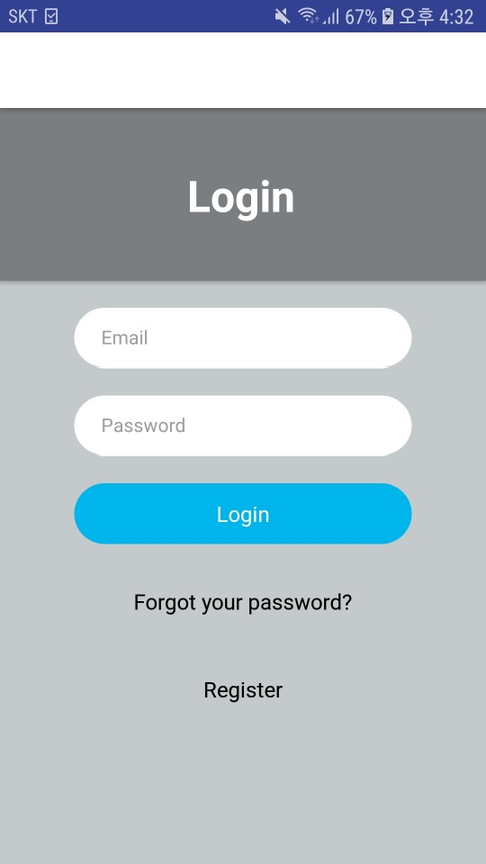

# EdgeOfSeoul

## 프로젝트 여기(여행과 기록)
 
여행 기록을 일지별로 제공하고 사진의 위도, 경도를 기반으로 지도 정보를 제공합니다.

관광지 api를 활용하여 위도, 경도 기반으로 관광지의 정보를 제공합니다.


### 프로젝트 구성
* 로그인
  * 회원가입
  * 비밀번호 찾기
* 프로필 화면
  * 피드
    * 피드 별 지도
* 일지 추가
  * 일지 정보 작성
  * 일지 지도 
* 관광지 검색


 


```c
#includ <stdio.h>

int main(void){
  printf("Hello World");
}


```

링크는 다음과 같이 작성할 수 있습니다.

[주소](https://www.youtube.com/watch?v=MFJIOqxK6k8)

* 깃 튜토리얼
  * 깃 clone
  * 깃 pull
  * 깃 commit
    * 깃 Commit 1)
    * 깃 Commit 2)


인용구문은 다음과 같이 작성할 수 있습니다.

> '공부합시다.' - abc -

테이블은 다음과 같이 작성할 수 있습니다.

이름|영어|정보|수학
---|---|---|---


강조는 다음과 같이 할 수 있습니다.

**치킨** 먹다가 ~~두드러기~~났어요.
